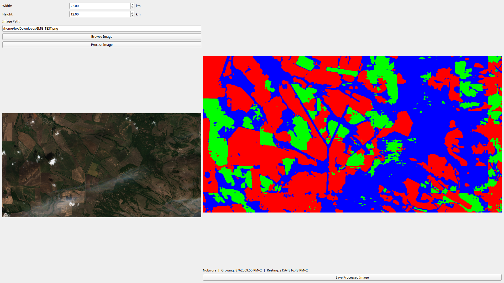
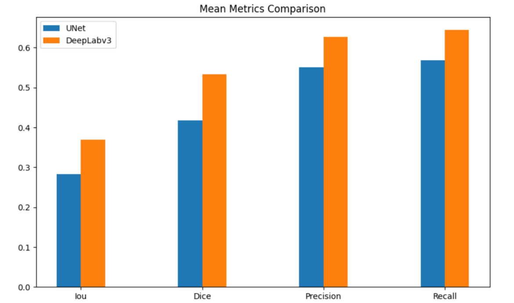

# Field Segmentation Project

Determine which agricultural fields are currently cultivated with plants and which are resting until next growing season using deep learning segmentation models.

## Table of Contents
- [Project Overview](#project-overview)
- [Installation](#installation)
- [API Documentation](#api)
- [Notebook Timeline](#notebook-timeline)
- [UI Interface](#ui)
- [Metrics](#metrics)

## Project Overview
This project combines computer vision and deep learning to analyze satellite/aerial imagery of agricultural fields. The system identifies:
- 🌱 **Growing Land**: Fields currently under cultivation
- 🛌 **Resting Land**: Fields lying fallow for seasonal recovery

**Key Features:**
- U-Net and DeepLabV3 segmentation models
- FastAPI backend for processing requests
- Dockerized deployment
- Data augmentation pipeline
- UI with PySide6

## Installation

### Prerequisites
- Python 3.8+
- Docker 20.10+
- NVIDIA GPU (recommended for training)

### Local Setup
```bash
git clone https://github.com/yourusername/field-segmentation.git
cd field-segmentation

# Install dependencies
pip install -r requirements.txt

# Start API server
uvicorn main:app --reload

# or run ui
python3 ui.py
```

### Docker Deployment
```bash
docker-compose up --build
```

### API

Endpoint: POST /process-land

Input parameters:

+ image: JPEG/PNG file upload

+ width: float > 0

+ length: float > 0

Response format:
```json
{
"processed_image": "base64_string",
"growing_land": float,
"resting_land": float
}
```

Access interactive docs at http://localhost:8000/docs after deployment.

### Notebook Timeline

1. mask_creation.ipynb - Creating masks from annotations
2. data_augmentation.ipynb - Image augmentation strategies
3. unet_example.ipynb - U-Net model implementation
4. DeepLabv3.ipynb - DeepLabV3+ configuration
5. metrics.ipynb - UNet vs DeepLabv3 results comparison

### UI

Simple UI was created using PySide6


### Metrics

Overall DeepLabv3 showed better results (see ```metrics.ipynb```)


